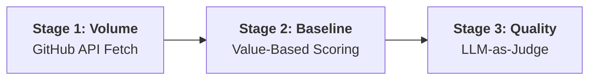

# Engineering Impact Dashboard — PostHog

> **Live Dashboard:** [https://weave-assignment.streamlit.app/](https://weave-assignment.streamlit.app/)
>
> **Approach (300 chars):** 3-stage pipeline: GitHub API → log-normalized value-based baseline (40% shipping, 30% reviews, 15% code, 15% issues) → LLM-as-judge quality multiplier (4 dimensions). Separates activity volume from engineering leverage. PR type multipliers reward features/fixes over chores.

---
**Brainstrom session(Non negotiable: 1hr time limit):**
- what is impact? To have a strong effect on someone or something. How does it translate to software engineers? positive delta in user experience, revenue or business metrics. 
- How to measure impact in SE? "Not Number of lines of code written", "Not Number of PRs merged", "Not Number of reviews given", "Not Number of issues opened/closed" but rather quality of work. 
- How to measure quality of work? Leverage LLM to evaluate the quality of work along with other metrics.

Assuming a busy engineering leader at PostHog, impact answers:
- **"Who is moving the product forward?"** (Shipping features and fixes)
- **"Who makes the team better?"** (Thoughtful code reviews, unblocking teammates)
- **"Who resolves problems?"** (Closing issues, not just opening them)
- **"Is this high-volume or high-leverage work?"** (Quality vs. quantity)

---

## Architecture: 3-Stage Pipeline



Looking at the content:
Stage 1: Volume (GitHub API Fetch)
- Merged PRs
- Reviews given
- Issues opened/closed
- Code stats

Stage 2: Baseline (Value-Based Scoring)
- Log-normalized formula
- Explicit % weights
- PR type multiplier

Stage 3: Quality (LLM-as-Judge)
- Top 15 engineers
- Top 10 PRs each
- 4 evaluation dims
- Quality multiplier (0.6x -> 1.4x)

A simple flow could be a list or a Mermaid flowchart.
Given the context of a README, a Mermaid flowchart is common, but "simple flow" might mean a horizontal arrow representation or a bulleted list.
However, the previous code was a diagram.


**GitHub API** (Volume) → **Log-Normalized Scoring** (Baseline) → **LLM-as-Judge** (Quality)


1. **GitHub API Fetch (Volume)**: Collects merged PRs, reviews, issues, and code stats.
2. **Value-Based Scoring (Baseline)**: Applies log-normalization, weights (40/30/15/15), and PR type multipliers.
3. **LLM-as-Judge (Quality)**: Evaluates the top 10 PRs for the top 15 engineers across 4 dimensions to apply a 0.6x–1.4x multiplier.

## Scoring Model: Rationale & Design

### The Problem with Count-Based Metrics

A naive formula like `impact = 15 * prs_merged + 15 * reviews_given` has two fatal flaws:

1. **Single-dimension dominance:** An engineer with 22 reviews gets 330 points from reviews alone, drowning out all other signals. The "top 5" becomes "who reviewed the most."
2. **No quality differentiation:** 20 typo fixes score the same as 3 complex, high-impact features.

### The Solution: Value-Based Scoring

Instead of flat points, I use a **log-normalized, type-weighted model** that reflects how engineering managers actually evaluate work.

#### Formula

```
Baseline Impact =
    Shipping Score (40%)    → log(1 + Σ(10 × type_multiplier per PR)) × 15
  + Review Score  (30%)     → log(1 + reviews_given) × 30
  + Code Volume   (15%)     → log10(1 + lines_changed) × 8
  + Issue Score   (15%)     → log(1 + closed×5 + opened×1) × 10

Final Score = Baseline × Quality Multiplier (from LLM)
```

#### Why These Weights?

| Dimension | Weight | Rationale |
|-----------|--------|-----------|
| **Shipping PRs** | 40% | Primary value driver. Merged PRs move the product forward. Features and fixes weighted higher than chores via title-based multiplier. |
| **Code Reviews** | 30% | Force multiplier. Reviews unblock teammates and maintain quality. Log-dampened because 10 rubber-stamp approvals ≠ 10× the value of 1 thoughtful review. |
| **Code Volume** | 15% | Substance signal. Larger changes generally require more engineering effort. Log10-dampened so a 10,000-line refactor doesn't dominate. |
| **Issue Resolution** | 15% | Problem-solving. Closing an issue (5 pts) is weighted 5× higher than just opening/commenting (1 pt). Resolution > identification. |

#### PR Type Multipliers (Inferred from Title)

| Prefix | Multiplier | Why |
|--------|-----------|-----|
| `feat:` / `feature:` | 1.5× | Features drive product forward |
| `fix:` / `bug:` | 1.3× | Fixes resolve real user pain |
| `refactor:` / `perf:` | 1.1× | Improves long-term codebase health |
| `chore:` / `docs:` | 0.7× | Necessary but lower impact |
| *(other)* | 1.0× | Default |

#### Why Logarithmic Scaling?

Log scaling provides **natural diminishing returns.** This is critical because:

- `log(1 + 5 PRs)` ≈ 1.79 vs `log(1 + 20 PRs)` ≈ 3.04 → 4× the PRs, only ~1.7× the score
- This means **no single dimension can dominate the ranking**, no matter how extreme the count
- An engineer with balanced contributions (some PRs + some reviews + some issues) will score comparably to someone with extreme volume in just one area

---

## LLM-as-Judge: Quality Multiplier

### Why?

Volume metrics tell you *how much* someone did. They can't tell you *how impactful* that work was. An engineer who ships 3 complex, high-leverage features should rank higher than someone who ships 20 config changes.

### How It Works

1. **Sample selection:** Top 15 engineers by baseline score, top 3 merged PRs each (sorted by change size as a proxy for complexity)
2. **Evaluation prompt:** The LLM acts as a "VP of Engineering" and rates each PR on 4 dimensions (1-5 scale):

| Dimension | Weight | What it Measures |
|-----------|--------|-----------------|
| **Substance & Complexity** | High (1.5×) | Is this a typo fix or a major architectural change? |
| **Product & Business Impact** | High (1.5×) | Does this unlock value for users or the business? |
| **Technical Excellence** | Medium (1.0×) | Is the code well-tested, documented, and well-crafted? |
| **Scope of Blast Radius** | Medium (1.0×) | How many systems/teams does this change affect? |

3. **Quality multiplier:** Average LLM score maps to a multiplier:
   - Score 5/5 → **1.4× boost** (exceptional work)
   - Score 3/5 → **1.0× neutral** (standard work)
   - Score 1/5 → **0.6× penalty** (trivial/low-quality work)

### Evaluation Criteria (The "Prompt")

The LLM is prompted to act as a **"Distinguished VP of Engineering"** and evaluates every PR against this strict rubric:

#### 1. Substance & Complexity (Weight: High)
| Score | Criteria |
|-------|----------|
| **5** | Major architectural change, new system/service, complex algorithm, or significant refactor affecting multiple subsystems |
| **3** | Standard feature implementation, moderate logic changes, or well-scoped module work |
| **1** | Typo fix, comment update, dependency bump, or trivial one-liner |

#### 2. Product & Business Impact (Weight: High)
| Score | Criteria |
|-------|----------|
| **5** | Directly enables a new revenue stream, unblocks a critical launch, or fixes a P0 user-facing issue |
| **3** | Enhances existing feature, improves UX, or addresses moderate user pain point |
| **1** | No direct user impact — internal chore, refactor for code health only, or dead code removal |

#### 3. Technical Excellence (Weight: Medium)
| Score | Criteria |
|-------|----------|
| **5** | Exemplary — introduces tests, updates docs, clean abstractions, handles edge cases, follows best practices |
| **3** | Adequate — functional but could use more tests or documentation |
| **1** | Poor — no tests, unclear intent, potential for regressions |

#### 4. Scope of Blast Radius (Weight: Medium)
| Score | Criteria |
|-------|----------|
| **5** | Touches core infrastructure used by 5+ teams/services (database schemas, shared libraries, auth) |
| **3** | Scoped to a single feature but with multiple touchpoints |
| **1** | Completely isolated — no downstream dependencies |

### What the LLM Sees

```
PR #12345: feat: Add real-time dashboard notifications
Code Stats: +487 additions / -52 deletions across 12 files
Total scope: 539 lines changed
Status: Merged at 2026-01-28

Context signals:
- Change density: 45 lines/file avg
- Net growth: +435 lines
- Review engagement: 3 reviewers participated
```

### Why This Matters for the Reviewer

The separation of **Baseline** (activity-only) vs **AI-Enhanced** (after quality multiplier) scores is shown explicitly in the dashboard. This lets the engineering leader:
- See who is *active* (baseline) vs who is doing *high-leverage* work (AI score)
- Understand whether the AI adjustment boosted or penalized someone, and by how much
- Make informed decisions about promotions, project assignments, or team structure

---

## Dashboard Features

- **Top 5 Impact Engineers** — Cards showing PRs, Reviews, Quality score, Baseline, and AI Score
- **Engineer Profile Drilldown** — Click "View Story" for:
  - **Story of Impact** — AI-generated narrative archetype (e.g., "The Unblocker", "Core Contributor")
  - **Radar Chart** — Multi-dimensional comparison vs. top-5 average
  - **Impact Breakdown** — Stacked bar showing how the baseline was composed (Shipping, Reviews, Code Volume, Issues)
  - **Baseline → AI Enhanced** — Visual transition showing the quality multiplier effect
  - **PR Timeline** — Chronological view of all merged PRs
- **Analytics Tabs** — Quality distribution, contributor list, and methodology documentation

---

## Tech Stack

| Component | Technology |
|-----------|-----------|
| Data Pipeline | Python, PyGithub |
| LLM Integration | pydantic-ai + DeepSeek (via OpenAI-compatible API) |
| Dashboard | Streamlit |
| Visualization | Plotly |
| Data Models | Pydantic |

---

## Running Locally

```bash
# Install dependencies
pip install -r requirements.txt

# Set environment variables
cp .env.example .env
# Add GITHUB_API_KEY and DEEPSEEK_API_KEY

# Run the data pipeline (fetches GitHub data + LLM evaluation)
python main.py

# Launch the dashboard
streamlit run dashboard.py
```

---

## Design Decisions & Tradeoffs

1. **Sample-based LLM evaluation:** I evaluate only the top 15 contributors' top 10 PRs each (≤150 LLM calls) rather than every PR. This is pragmatic for time limit and API costs while still providing meaningful quality differentiation.

2. **Title-based PR type inference:** Rather than making additional API calls for labels, I infer PR type from conventional commit prefixes in the title. This is imperfect but fast and works well for repos that follow naming conventions.

3. **Log normalization everywhere:** The previous linear formula allowed a single dimension (reviews) to completely dominate rankings. Log scaling ensures balanced, multi-dimensional impact measurement.

4. **Closing > Opening for issues:** I explicitly weight closing an issue 5× higher than opening one. Impact is defined by *resolving problems for users*, not just identifying them.

5. **Transparent AI adjustment:** Both baseline and AI-enhanced scores are shown side-by-side with the multiplier delta, so the engineering leader can judge for themselves whether the AI's assessment makes sense.